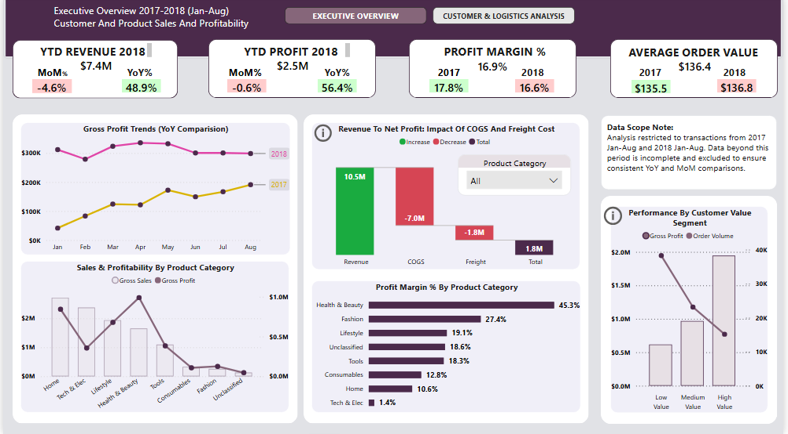
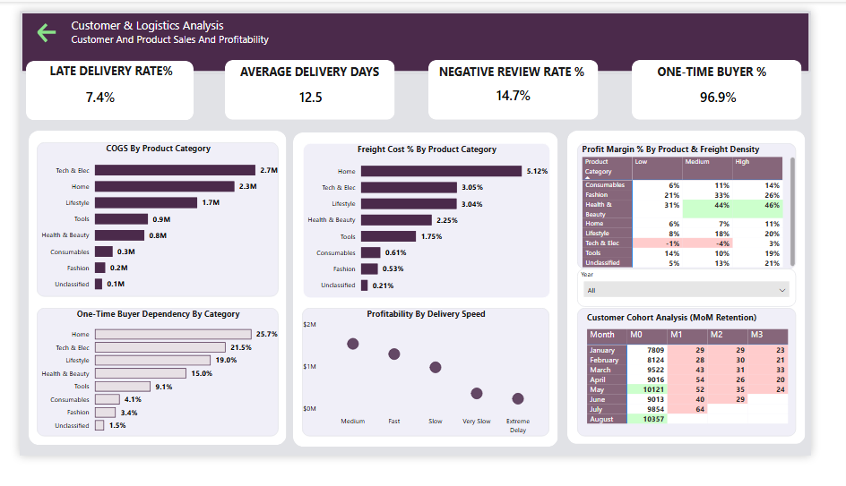

# Financial-Performance-And-Logistics-Optimization-Analysis
### PostgreSQL + Power BI + Python 

## Project Overview
This project provides an end-to-end data analysis of the Brazilian e-commerce market. While the business has experienced a significant surge in order volume and revenue growth, this expansion has not translated equally into profitability across all product categories and customer segments.

The analysis focuses on diagnosing margin erosion, identifying logistics bottlenecks, evaluating customer retention cohorts, and uncovering data-driven opportunities to stabilize margins and drive sustainable growth.

## Tools & Technologies
- PostgreSQL & pgadmin
- Python (pandas,scikit-learn,sqlalchemy)
- Power BI, DAX & Power Query

## Data Preparation & Feature Engineering. 
- Identified and resolved impossible chronological order sequences where carrier dispatch or customer delivery preceded purchase timestamps. 

- Handled missing physical product metrics using data-driven median imputation 

- Engineered `delivery_days` Delivery Date - Purchase Date and created a conditional 'delay_category' attribute to index fulfillment speeds(Fast, Medium, Slow, Very Slow, Extreme Delay).

- Developed a `macro_product_category_name` field, rolling up over 70 granular English categories into 7 strategic business sectors

- Deployed a window function ranking engine to segment unique consumers by Average Order Value (AOV) 

## Key Insights
- Home & Living and Health & Beauty were the primary profit-driving categories.
- Technology & Electronics generated high revenue but delivered the lowest profit margins.
- Freight costs % were a major source of margin erosion.
- High-density products consistently outperformed low-density products in profitability.
- Business growth depended heavily on customer acquisition, with low customer retention rates.
- High-value customers generated the highest revenue and profit despite representing a smaller customer segment.

## Advanced Statistical Analysis
- Freight cost % was the strongest driver of margin erosion (R² = 86.6%). A 1% increase in freight cost reduced profit margin by approximately 1.02 percentage points.
- Delivery delays and higher COGS were also statistically associated with lower profit margins.
- Order-level cohort analysis showed freight costs consumed 45.1% of low-value order revenue versus 12% for high-value orders, highlighting the importance of increasing basket size.

## Dashboard Preview

### Executive Overview

### Customer & Logistics Analysis

## View Interactive Dashboard
[Download Dashboard](https://drive.google.com/file/d/1Yju8VEfVvRB0rn5B3DzZwrodi3k7fbLm/view?usp=drive_link)

## Recommendations
- Continue investing in high-performing categories such as Home & Living and Health & Beauty.
- Improve Technology & Electronics profitability by reducing logistics and product costs.
- Implement loyalty and retention programs to increase repeat purchases.
- Prioritize engagement and retention of high-value customers.
- Make efforts to shift low value customers into higher value segments.

## Dataset
https://www.kaggle.com/datasets/olistbr/brazilian-ecommerce

## Author
Faiza

> Note:

> Analysis restricted to transactions from 2017 Jan-Aug to 2018 Jan-Aug. Data beyond this period is incomplete and excluded to ensure consistent YoY and MoM comparisons.

> Due to file size, GitHub cannot preview the MS Word file. Please download the file to view the full report.

> If you like this project, feel free to star the repo!

